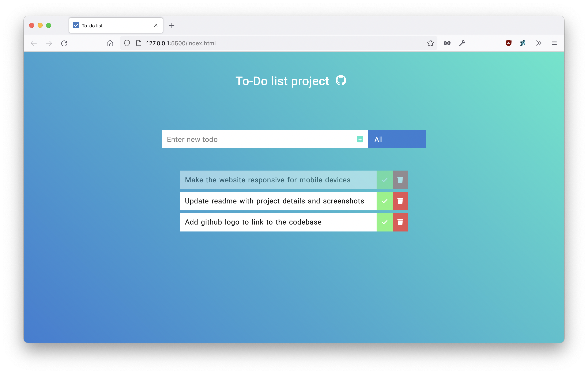

# Todo

A simple Todo project, built with JS. The project is created following the guidance from [DevEd Todo project from Youtube](https://www.youtube.com/watch?v=Ttf3CEsEwMQ).

<button style="background-color: aliceblue; border-radius: 10px; padding: 10px 25px; font-size: 1.2rem; font-weight: bold; cursor: pointer; border: 0;"><a style="text-decoration: none" href="https://avinash-lvs.github.io/Todo/">Live Demo</a></button>

## Preview

## Features

-   Add new todo
-   Mark completed
-   Delete todo
-   Filter todos based on the status of completion
-   Store in local storage
